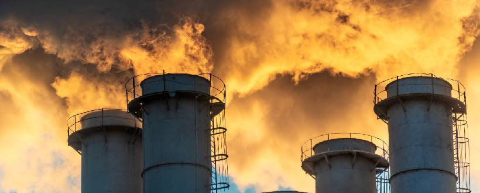

# Residuos Informáticos (e-Waste)
### El desafío ambiental de la era digital

---

## El Ciclo de Vida del Hardware

> ### 🟢 ¿Qué son realmente los RAEE?
> Los **Residuos de Aparatos Eléctricos y Electrónicos (RAEE)** no son basura convencional. Son una mezcla compleja de materiales de alto valor y sustancias altamente peligrosas. Su gestión comienza desde el momento en que un dispositivo se vuelve inútil y termina en plantas de tratamiento donde se intenta recuperar su valor residual.

  

> [!IMPORTANT]
> **¿Sabías que...?** Se estima que para el año 2030, el mundo generará más de **74 millones de toneladas métricas** de residuos electrónicos anuales. Esto equivale al peso de 350 cruceros de gran tamaño.

---

## Minería Urbana: El Tesoro en la Basura

La **minería urbana** consiste en recuperar materiales de dispositivos desechados. Es mucho más eficiente que la minería tradicional.

### 💎 Metales Preciosos
Un smartphone contiene **oro, plata y paladio**. Su recuperación reduce la necesidad de explotaciones mineras destructivas.

### 🌍 Tierras Raras
Elementos como el **neodimio** (en imanes) y el lantano son vitales pero escasos. El reciclaje es la única forma sostenible de suministro.

### ⚙️ Cobre y Aluminio
Presentes en cables y disipadores. El reciclaje de aluminio ahorra hasta un **95% de la energía** comparado con la producción de material virgen.

### 🔋 Litio y Cobalto
Fundamentales para **baterías**. Su recuperación evita la minería en ecosistemas sensibles y reduce dependencias geopolíticas.

---

## Impacto Químico y Toxicidad

El peligro surge cuando estos residuos terminan en vertederos ilegales. La lluvia filtra los metales hacia los acuíferos (**lixiviación**).

| Componente | Ubicación Común | Impacto Ambiental y Salud |
| :--- | :--- | :--- |
| **Cadmio** | Baterías viejas y resistencias. | Afecta riñones y la estructura ósea. |
| **Mercurio** | Monitores planos y lámparas. | Neurotóxico persistente en la cadena alimentaria. |
| **Bario** | Tubos de imagen (CRT). | Provoca debilidad muscular y daños cardíacos. |
| **Plomo** | Soldaduras y cristales. | Contamina el suelo por siglos; afecta el desarrollo. |

---

## La Cara Oculta: La Huella Hídrica y Energética

* **Agua:** Fabricar un solo microchip requiere miles de litros de agua ultra pura.
* **Energía:** La fase de producción de un portátil representa el **70-80%** de su huella de carbono total.

  

---

## Estrategias de Mitigación Profesional

1.  **Responsabilidad Ampliada del Productor (RAP):** Las marcas financian la recogida de sus productos.
2.  **Ecodiseño:** Dispositivos sin pegamento y con tornillos estándar para fácil reparación.
3.  **Certificaciones Verdes:** Sellos como *EPEAT* o *TCO* que garantizan baja toxicidad.

---

## Conclusión: El Futuro de nuestra Huella Digital

### Hacia una Tecnología Responsable
La gestión de los residuos informáticos es un **imperativo ético**. La solución requiere un enfoque de tres puntos:

* **Las Empresas:** Deben abandonar la obsolescencia programada y adoptar el ecodiseño.
* **Los Gobiernos:** Necesitan endurecer las leyes de reciclaje y garantizar el **"Derecho a Reparar"**.
* **Los Usuarios:** Debemos transitar hacia un consumo consciente. El dispositivo más ecológico es el que ya tenemos.

> *"La verdadera innovación no es solo crear hardware más potente, sino crear tecnología que pueda coexistir en armonía con los límites biológicos de nuestro planeta."*

---

[🏠 Volver al Inicio](index.html) | [Obsolescencia Programada ➜](Sergio_obsolescencia.html)
