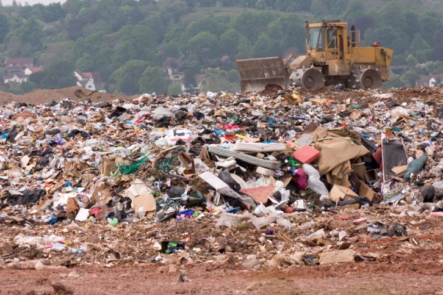

  <h1 style="margin: 0; font-size: 2.5em; text-transform: uppercase; letter-spacing: 1px;">Contaminación Ambiental</h1>

---

## ¿Qué es la contaminación ambiental?

La **contaminación ambiental** es la presencia de sustancias o elementos dañinos en el entorno que afectan negativamente a la naturaleza y a los seres vivos.
Este fenómeno no solo se limita a la acumulación de desechos visibles; también incluye formas invisibles de alteración como la contaminación acústica, lumínica y térmica. Cada una de estas variantes rompe el ciclo natural de autorregulación de la Tierra. El problema radica en que el ritmo al que los seres humanos generamos estos residuos supera con creces la capacidad del planeta para procesarlos o eliminarlos, lo que genera un efecto acumulativo con consecuencias a largo plazo para las futuras generaciones.

--- 

## Explicación ampliada

La contaminación ambiental ocurre cuando sustancias **físicas, químicas o biológicas** alteran el equilibrio natural del medio ambiente.

  
  

    
Contaminación del Aire

    
Se produce cuando gases tóxicos y partículas contaminantes se liberan a la atmósfera, afectando la calidad del aire que respiramos.

    <ul>
      <li>Emisiones de vehículos e industrias</li>
      <li>Quema de combustibles fósiles</li>
      <li>Incendios forestales</li>
    </ul>
  

  
  

    
Contaminación del Agua

    
Ocurre cuando residuos químicos o basura contaminan ríos, lagos y océanos, afectando tanto a la fauna como a los seres humanos.

    <ul>
      <li>Vertidos industriales y plásticos</li>
      <li>Derrames de petróleo</li>
      <li>Fertilizantes agrícolas</li>
    </ul>
  

  
  

    
Contaminación del Suelo

    
Sucede cuando residuos sólidos o productos químicos se acumulan en la tierra, dañando los ecosistemas y la producción agrícola.

    <ul>
      <li>Uso de pesticidas y químicos</li>
      <li>Acumulación de basura sólida</li>
    </ul>
  

---

## Impactos de la Contaminación Ambiental

<table class="tabla-bonita">
  <thead>
    <tr>
      <th>Impacto</th>
      <th>Descripción</th>
    </tr>
  </thead>
  <tbody>
    <tr>
      <td><strong>Salud humana</strong></td>
      <td>Puede provocar enfermedades respiratorias y cardiovasculares.</td>
    </tr>
    <tr>
      <td><strong>Ecosistemas</strong></td>
      <td>Destrucción de hábitats naturales y alteración de los equilibrios.</td>
    </tr>
    <tr>
      <td><strong>Biodiversidad</strong></td>
      <td>Desaparición de especies animales y vegetales.</td>
    </tr>
    <tr>
      <td><strong>Clima</strong></td>
      <td>Aumento de la temperatura global y cambios climáticos.</td>
    </tr>
  </tbody>
</table>

---

## Posibles soluciones

1. **Usar energías renovables** como solar o eólica.  
2. **Reducir el uso de plásticos** y fomentar materiales reutilizables.  
3. **Reciclar correctamente** los residuos.  
4. **Utilizar transporte público, bicicleta o caminar.**

---

## Conclusión

  
Cuidar el planeta es responsabilidad de todos

  
La contaminación ambiental es uno de los mayores desafíos del mundo actual. Reducirla requiere educación ambiental y cambios en los hábitos de consumo.
  Más allá de las grandes normativas gubernamentales, la clave reside en la transición hacia una economía circular, donde el concepto de "desperdicio" desaparezca y cada recurso sea aprovechado al máximo. Adoptar una mentalidad de respeto hacia nuestro entorno inmediato es el primer paso para revertir el daño causado. La tecnología, si se usa de forma ética y responsable, puede ser nuestra mejor aliada para limpiar los océanos y purificar el aire que compartimos.

  

    "Proteger el medio ambiente no es solo una opción, es una necesidad para el futuro."
  

---

  <a href="index.html" style="text-decoration:none; color:#38bdf8; font-weight:bold;">🏠 Volver al Inicio</a>
  <a href="Manuel_residuos.html" style="text-decoration:none; color:#38bdf8; font-weight:bold;"> Residuos informáticos ➜</a>

