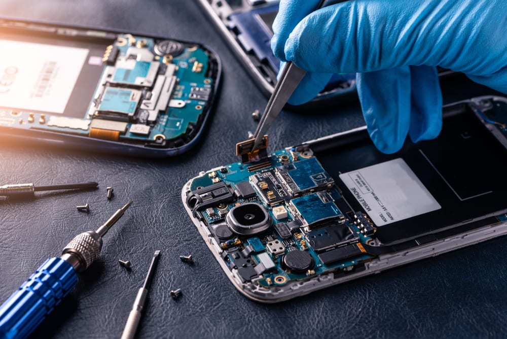

# Obsolescencia Programada
### El desafío de la durabilidad en la era digital

> **"Un producto que no se desgasta es una tragedia para los negocios."**

---

## 1. ¿Qué es exactamente?

> ### 🟢 Definición Técnica
> Es el diseño de un producto con una **vida útil limitada artificialmente**. Los fabricantes calculan el momento exacto en el que el dispositivo debe fallar o volverse incompatible para forzar al consumidor a comprar la siguiente versión. No es un error de ingeniería, es una decisión de negocio.

  
   
  <em><strong>Cartel Phoebus: El origen de la obsolescencia programada.</strong></em>

---

## 2. Un poco de historia: El Cartel Phoebus

En 1924, los principales fabricantes de bombillas del mundo formaron el **Cartel Phoebus**. Su objetivo: reducir la duración de las bombillas de **2.500 horas a solo 1.000**. Este fue el nacimiento oficial de esta práctica para asegurar ventas recurrentes.

---

## 3. Tipos y Funcionamiento

La obsolescencia no siempre es que algo se rompa físicamente; existen diferentes estrategias:

### 🔵 Obsolescencia de Software
Actualizaciones que vuelven lentos los dispositivos o apps que dejan de ser compatibles con hardware que aún funciona perfectamente.

### 🟠 Obsolescencia Técnica
Uso de materiales frágiles o componentes diseñados para fallar tras un número determinado de ciclos de uso.

### 🟣 Barreras de Reparación
Piezas pegadas y falta de repuestos oficiales. El objetivo es que reparar sea **más caro** que comprar un producto nuevo.

  
   
  <em><strong>Consumo más barato que arreglar.</strong></em>

---

## 4. El Impacto en nuestro Planeta

Cada vez que renovamos un dispositivo prematuramente, el medio ambiente sufre las consecuencias:

| Recurso | Impacto de la Renovación |
| :--- | :--- |
| **Minerales Raros** | Extracción intensiva de litio y coltán en zonas críticas. |
| **Energía** | Fabricar un móvil consume el 80% de la energía de toda su vida. |
| **Residuos** | Millones de toneladas de metales pesados contaminan suelos. |

  
   
  <em><strong>Consecuencias: producción, consumo, gastos y residuos.</strong></em>

---

## 5. ¿Hay soluciones?

Existen movimientos como el **"Right to Repair"** (Derecho a Reparar) y empresas que diseñan hardware modular para combatir esta tendencia.

  
   
  <em><strong>Derecho a reparar.</strong></em>

---

[🏠 Volver al Inicio](index.html) | [Informática Ecológica ➔](Sergio_informatica.html)
